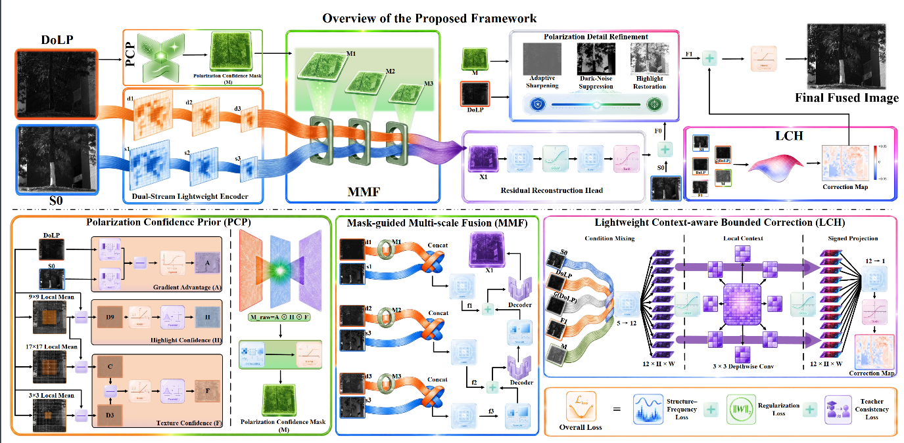
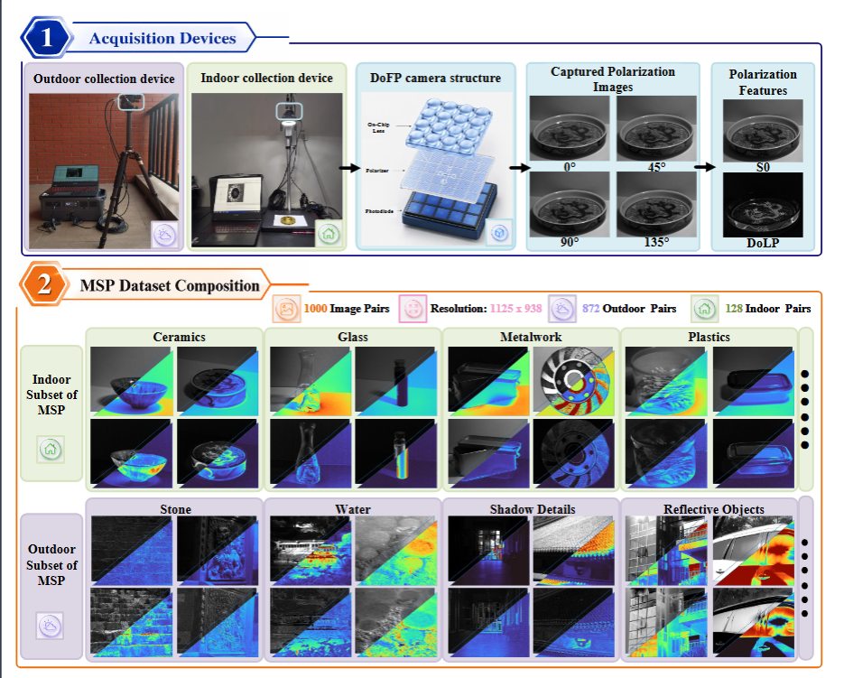
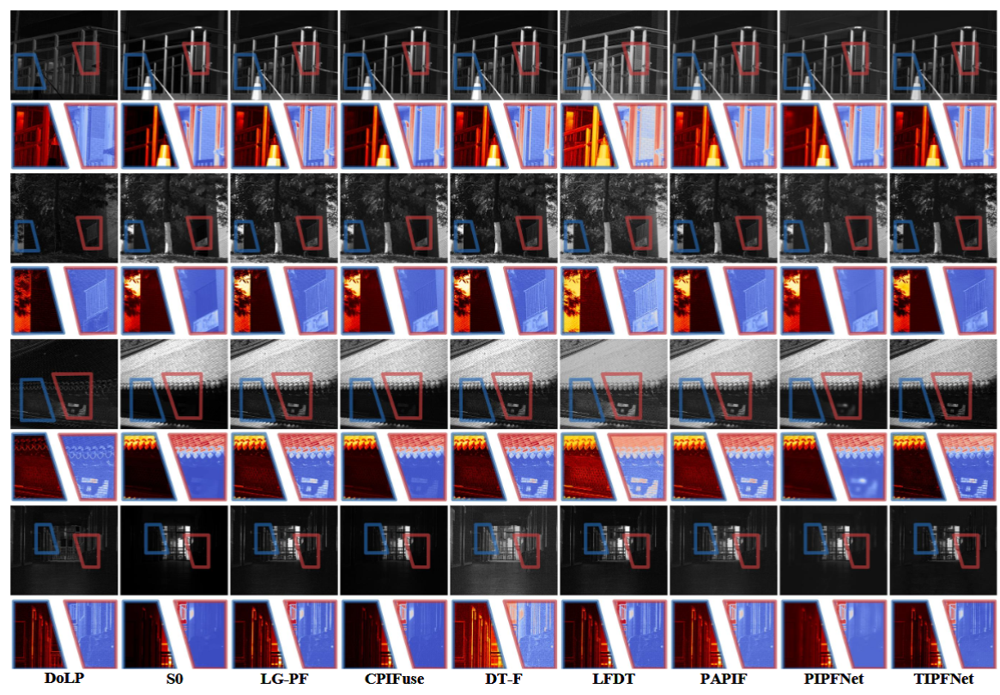
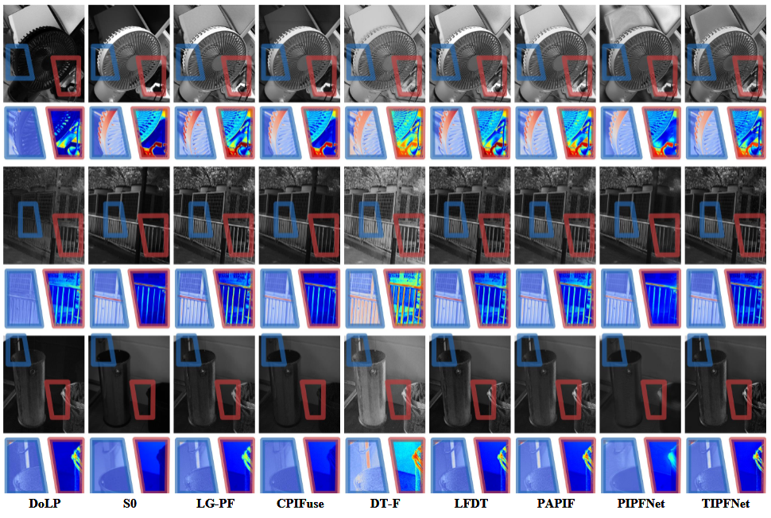
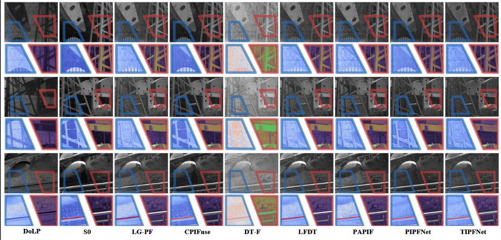
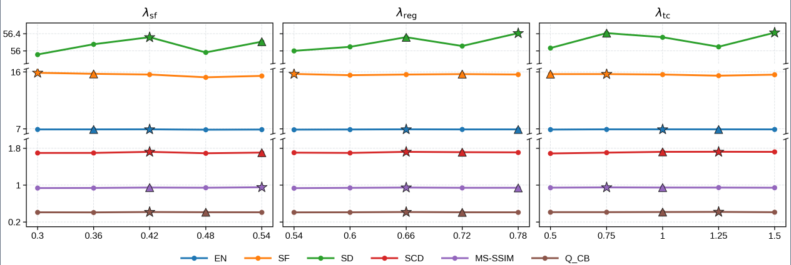

# LG-PF: Lightweight Confidence-Guided Polarization Image Fusion

<p align="center">
  🌐 <b>English</b> | <a href="./README_CN.md">简体中文</a>
</p>

<p align="center">
  <b>Zhuangfan Huang</b>,
  Zhenyu Kuang,
  Huafeng Li,
  Gao Wang,
  Yang Liu,
  Haishu Tan,
  Xiaosong Li
</p>

<p align="center">
  <a href="https://arxiv.org/abs/2609.12787">
    
  </a>
  <a href="https://pan.baidu.com/s/1FAuq250fF-A7OH4s8SJHoA?pwd=sw5c">
    
  </a>
</p>

<p align="center">
  <a href="https://arxiv.org/abs/2609.12787">arXiv</a> |
  <a href="#overview">Overview</a> |
  <a href="#network-architecture">Network</a> |
  <a href="https://pan.baidu.com/s/1FAuq250fF-A7OH4s8SJHoA?pwd=sw5c">Dataset</a> |
  <a href="#experimental-results">Results</a> |
  <a href="#installation">Installation</a> |
  <a href="#training">Training</a> |
  <a href="#testing">Testing</a>
</p>

---

# Overview

Polarization image fusion combines the stable luminance and structural information of the total-intensity image **S0** with the material-sensitive details contained in the degree of linear polarization (**DoLP**) image.

However, the informativeness of DoLP is spatially nonuniform. Indiscriminate polarization transfer may amplify unstable responses or disturb the structural appearance anchored by S0.

We propose **LG-PF**, a lightweight confidence-guided polarization image fusion framework that formulates polarization fusion as a **selective residual transfer process**.

LG-PF contains three key components:

- **Polarization Confidence Prior (PCP)**  
  Estimates spatially informative polarization responses.

- **Mask-guided Multi-scale Fusion (MMF)**  
  Regulates confidence-guided polarization transfer across three feature scales.

- **Lightweight Context-aware Bounded Correction Head (LCH)**  
  Performs lightweight bounded correction of local photometric and structural transitions.

The same confidence guidance is further incorporated into the optimization objectives to preserve informative polarization-sensitive details while suppressing unsupported responses.

We also construct **MSP**, a multi-scene polarization fusion dataset containing **1000 pixel-aligned S0–DoLP image pairs from 17 indoor and outdoor scene categories**.

---

# Network Architecture

<p align="center">
  
</p>

<p align="center">
  <b>Fig. 1. Overall architecture of the proposed LG-PF.</b>
</p>

LG-PF follows a lightweight dual-stream fusion pipeline:

1. **Dual-stream lightweight encoding** of S0 and DoLP.
2. **PCP-based spatial confidence estimation**.
3. **MMF-based confidence-guided multi-scale polarization transfer**.
4. **Residual reconstruction and polarization detail refinement**.
5. **LCH-based bounded local correction**.

The total-intensity image S0 serves as the photometric and structural anchor, while complementary DoLP information is selectively introduced through confidence-guided residual transfer.

---

# Core Modules

## Polarization Confidence Prior (PCP)

PCP estimates a spatial polarization confidence mask by jointly considering:

- Local polarization-response prominence
- Fine-scale texture evidence
- Cross-modal gradient advantage of DoLP over S0

The three confidence cues are combined to generate a shared polarization confidence mask.

This confidence mask is used to regulate polarization information transfer throughout the network and is further incorporated into the optimization objectives.

---

## Mask-guided Multi-scale Fusion (MMF)

MMF extracts three-scale features from the S0 and DoLP branches.

At each feature scale, the polarization feature is modulated by the resized confidence mask through a soft confidence-gating mechanism.

The minimum polarization retention coefficient is:

```text
eta = 0.35
```

This design preserves high-confidence polarization information while attenuating, rather than completely discarding, uncertain polarization responses.

The confidence-modulated DoLP features are subsequently combined with the corresponding S0 features through lightweight channel mixing.

The fused multi-scale representations are progressively decoded to obtain a full-resolution feature representation, from which a polarization residual is predicted and added to the S0 structural anchor.

---

## Lightweight Context-aware Bounded Correction Head (LCH)

LCH performs lightweight local correction instead of reconstructing the complete fused image.

Its inputs include:

- S0
- Gradient magnitude of DoLP
- DoLP
- Refined fusion result F1
- Polarization confidence mask M

These five maps are processed through compact pointwise and depthwise convolutions to predict a signed correction map.

The correction magnitude is explicitly bounded using:

```text
lambda_c = 0.05
```

This design stabilizes local photometric and structural transitions while introducing only minor computational overhead.

---

# MSP Dataset

<p align="center">
  <a href="https://pan.baidu.com/s/1FAuq250fF-A7OH4s8SJHoA?pwd=sw5c">
    
  </a>
</p>

<p align="center">
  <b>MSP Dataset:</b>
  <a href="https://pan.baidu.com/s/1FAuq250fF-A7OH4s8SJHoA?pwd=sw5c">Baidu Netdisk</a>
  &nbsp; | &nbsp;
  Password: <code>sw5c</code>
</p>

We construct **MSP**, a multi-scene polarization fusion dataset containing **1000 pixel-aligned S0–DoLP image pairs**.

MSP contains:

- **1000 image pairs**
- **872 outdoor pairs**
- **128 indoor pairs**
- **17 scene categories**
- **Resolution: 1125 × 938**

The dataset is divided as follows:

| Split | Number of Image Pairs |
|---|---:|
| Training | 900 |
| Validation | 50 |
| Testing | 50 |
| **Total** | **1000** |

MSP covers diverse polarization-sensitive materials and imaging conditions.

Representative indoor scenes include:

- Ceramics
- Glass
- Metalwork
- Plastics

Representative outdoor scenes include:

- Stone surfaces
- Water regions
- Shadow details
- Reflective objects

The dataset further covers daytime and nighttime scenes, varying illumination and exposure conditions, reflections, shadows, and diverse real-world environments.

---

## MSP Dataset Illustration

<p align="center">
  
</p>

<p align="center">
  <b>Fig. 2. Acquisition systems and composition of the MSP dataset, including the DoFP imaging process, four-direction polarization observations, derived S0 and DoLP images, and representative indoor and outdoor scenes.</b>
</p>

---

## Table I. Comparison with Existing Polarization Fusion Datasets

| Dataset | Acquisition Pattern | Total Pairs | Indoor Pairs | Outdoor Pairs | Scene Categories | Image Size |
|---|---|---:|---:|---:|---:|---:|
| PIF | DoFP | 74 | 5 | 69 | N/R | 1024 × 1224 |
| GAND | DoFP | 415 | 331 | 84 | N/R | 768 × 576 |
| **MSP (Proposed)** | **DoFP** | **1000** | **128** | **872** | **17** | **1125 × 938** |

---

# Installation

The source code and detailed environment configuration will be released in this repository.

After the code is released, install the required dependencies using:

```bash
pip install -r requirements.txt
```

---

# Training

The MSP dataset split used in the paper is:

```text
Training   : 900 image pairs
Validation : 50 image pairs
Testing    : 50 image pairs
```

Before training, please modify the dataset path according to your local environment.

```bash
# The exact training command will be updated together with the released code.
python train.py
```

The model is trained from scratch on the MSP training set.

The main training configuration reported in the paper includes:

```text
Optimizer           : AdamW
Batch size          : 16
Initial learning rate: 5e-5
Weight decay        : 5e-5
Training epochs     : 175
Selected checkpoint : Epoch 130
Base channel width  : 16
GPU                 : NVIDIA GeForce RTX 3090
```

---

# Testing

LG-PF is evaluated on:

- MSP test set
- PIF fixed subset
- GAND fixed subset

For the PIF and GAND evaluations, LG-PF is directly evaluated **without fine-tuning or domain adaptation**.

```bash
# The exact testing command will be updated together with the released code.
python test.py
```

---

# Experimental Results

## Table II. Quantitative Comparison on MSP

| Method | EN ↑ | SF ↑ | SD ↑ | SCD ↑ | MS-SSIM ↑ | QCB ↑ |
|---|---:|---:|---:|---:|---:|---:|
| **LG-PF** | **6.5485** | **15.6979** | **46.0210** | **1.6632** | **0.9439** | **0.3099** |
| CPIFuse | 6.3884 | 8.9657 | 40.8085 | 1.4867 | 0.9296 | 0.3020 |
| DT-F | 6.5269 | 15.5525 | 40.4660 | 1.6563 | 0.7926 | 0.2621 |
| LFDT | 6.5263 | 12.1124 | 45.5976 | 1.6251 | 0.9387 | 0.3074 |
| PAPIF | 6.4486 | 10.8050 | 42.7253 | 1.5935 | 0.9057 | 0.2892 |
| PIPFNet | 6.3281 | 8.0722 | 39.0078 | 1.1774 | 0.7650 | 0.2727 |
| TIPFNet | 6.3078 | 10.8383 | 38.0155 | 1.5136 | 0.8252 | 0.2996 |

LG-PF achieves the best performance across all six evaluated metrics on the MSP test set.

---

## Qualitative Comparison on MSP

<p align="center">
  
</p>

<p align="center">
  <b>Fig. 3. Qualitative comparison on representative samples from the MSP test set.</b>
</p>

LG-PF selectively preserves polarization-sensitive details while maintaining the photometric and structural information anchored by S0.

---

# Cross-Dataset Evaluation

To investigate cross-dataset transferability, the trained LG-PF model is directly evaluated on fixed subsets of **PIF** and **GAND** without fine-tuning or domain adaptation.

---

## PIF Dataset

### Table III. Quantitative Comparison on PIF

| Method | EN ↑ | SF ↑ | SD ↑ | SCD ↑ | MS-SSIM ↑ | QCB ↑ |
|---|---:|---:|---:|---:|---:|---:|
| **LG-PF** | **7.4989** | **23.2688** | **63.8530** | 1.5917 | **0.9214** | 0.4562 |
| CPIFuse | 7.3479 | 13.8353 | 55.0505 | 1.5699 | 0.9155 | 0.4165 |
| DT-F | 7.3064 | 21.7685 | 52.4917 | **1.7609** | 0.8166 | 0.3603 |
| LFDT | 7.4509 | 17.8186 | 62.7805 | 1.5718 | 0.9175 | **0.4728** |
| PAPIF | 7.4261 | 17.0269 | 60.0223 | 1.6770 | 0.9140 | 0.4455 |
| PIPFNet | 7.2163 | 13.1146 | 55.7901 | 1.4345 | 0.8443 | 0.3887 |
| TIPFNet | 7.2585 | 15.7598 | 52.8156 | 1.5841 | 0.8583 | 0.4494 |

---

### Qualitative Comparison on PIF

<p align="center">
  
</p>

<p align="center">
  <b>Fig. 4. Qualitative comparison on randomly selected PIF samples without fine-tuning.</b>
</p>

LG-PF preserves material-sensitive textures and object boundaries while maintaining the overall luminance distribution of S0.

---

## GAND Dataset

### Table IV. Quantitative Comparison on GAND

| Method | EN ↑ | SF ↑ | SD ↑ | SCD ↑ | MS-SSIM ↑ | QCB ↑ |
|---|---:|---:|---:|---:|---:|---:|
| **LG-PF** | **6.9700** | **17.6705** | **39.1293** | 1.7269 | 0.7335 | 0.5290 |
| CPIFuse | 6.8694 | 11.3982 | 36.9481 | 1.7230 | **0.9430** | **0.5883** |
| DT-F | 6.8655 | 16.6782 | 29.9436 | **1.8802** | 0.6180 | 0.3696 |
| LFDT | 6.8695 | 14.7905 | 38.2868 | 1.7196 | 0.5697 | 0.4923 |
| PAPIF | 6.9613 | 14.5522 | 38.8881 | 1.7233 | 0.6147 | 0.4716 |
| PIPFNet | 6.8056 | 13.4443 | 36.9769 | 1.6107 | 0.8007 | 0.5078 |
| TIPFNet | 6.6308 | 12.8721 | 31.6894 | 1.8365 | 0.7013 | 0.5261 |

---

### Qualitative Comparison on GAND

<p align="center">
  
</p>

<p align="center">
  <b>Fig. 5. Qualitative comparison on a randomly selected GAND sample without fine-tuning.</b>
</p>

The evaluations on PIF and GAND provide promising evidence of cross-dataset transferability without fine-tuning or domain adaptation.

---

# Ablation Study

## Table V. Ablation Study of Key Modules

| Method | EN ↑ | SF ↑ | SD ↑ | SCD ↑ | MS-SSIM ↑ | QCB ↑ |
|---|---:|---:|---:|---:|---:|---:|
| Full Model | **6.9094** | 15.5907 | 56.3164 | **1.7211** | 0.9466 | 0.4165 |
| w/o PCP | 6.8752 | 16.5595 | **56.3806** | 1.7019 | 0.9251 | 0.4119 |
| w/o MMF | 6.8931 | 15.3270 | 55.8327 | 1.7063 | **0.9475** | **0.4224** |
| w/o LCH | 6.8962 | 15.1074 | 56.2214 | 1.7054 | 0.9403 | 0.4190 |
| Baseline | 6.8653 | **16.8300** | 56.1553 | 1.7012 | 0.9233 | 0.4129 |

Removing individual components results in different trade-offs among information content, structural fidelity, and perceptual quality. The complete LG-PF model provides the most consistent overall performance across the evaluated metrics.

---

## Table VI. Ablation Study of Loss Configurations

| Setting | EN ↑ | SF ↑ | SD ↑ | SCD ↑ | MS-SSIM ↑ | QCB ↑ |
|---|---:|---:|---:|---:|---:|---:|
| Full Loss | **6.9094** | 15.5907 | 56.3164 | **1.7211** | 0.9466 | **0.4165** |
| w/o LREG | 6.8767 | 15.6931 | 56.1723 | 1.6984 | **0.9535** | 0.4119 |
| w/o LSF | 6.8942 | **15.7950** | 56.7184 | 1.7093 | 0.9230 | 0.4147 |
| w/o LTC | 6.7902 | 15.3528 | **56.7781** | 1.3409 | 0.8917 | 0.4107 |
| LTC with PAPIF only | 6.8869 | 15.5807 | 55.4955 | 1.6954 | 0.9316 | 0.4005 |
| LTC with LFDT only | 6.7906 | 14.9664 | 55.9281 | 1.6028 | 0.9415 | 0.4160 |

The loss ablation results demonstrate the complementary roles of structure-frequency constraints, regularization, and teacher-consistency guidance.

---

# Hyperparameter Sensitivity

<p align="center">
  
</p>

<p align="center">
  <b>Fig. 6. Sensitivity analysis of the three group-level loss weights.</b>
</p>

The final loss-weight configuration adopted in LG-PF is:

```text
lambda_sf  = 0.42
lambda_reg = 0.66
lambda_tc  = 1.00
```

The evaluated metrics remain relatively stable under moderate variations of these loss weights.

---

# Computational Efficiency

## Table VII. Comparison of Computational Efficiency

| Method | FLOPs (G) ↓ | Parameters (M) ↓ | Time (ms) ↓ |
|---|---:|---:|---:|
| **LG-PF** | **51.9883** | 0.2936 | **21.7120** |
| CPIFuse | 173.8998 | 0.8740 | 110.8920 |
| LFDT | 1936.6296 | 17.8980 | 692.8200 |
| PAPIF | 287.4564 | 0.2609 | 323.3230 |
| PIPFNet | 76.3328 | **0.0343** | 288.6660 |
| TIPFNet | 979.7782 | 4.1509 | 485.6140 |
| DT-F | 737.8300 | 0.8344 | 4951.9010 |

Under an input resolution of **1125 × 938** and the reported RTX 3090 setting, LG-PF requires only **0.2936 M parameters** and **51.9883 G FLOPs**, with an inference time of **21.712 ms per image**.

LG-PF achieves the lowest computational complexity and fastest inference time among the evaluated methods while maintaining a compact model size.

---

# Citation

If you find **LG-PF** or the **MSP dataset** useful in your research, please cite our work:

**Paper:** LG-PF: Lightweight Confidence-Guided Polarization Image Fusion  
**arXiv:** [https://arxiv.org/abs/2609.12787](https://arxiv.org/abs/2609.12787)

```bibtex
@article{huang2026lgpf,
  title   = {LG-PF: Lightweight Confidence-Guided Polarization Image Fusion},
  author  = {Huang, Zhuangfan and Kuang, Zhenyu and Li, Huafeng and Wang, Gao and Liu, Yang and Tan, Haishu and Li, Xiaosong},
  journal = {arXiv preprint arXiv:2609.12787},
  year    = {2026},
  url     = {https://arxiv.org/abs/2609.12787}
}
```

---

# Acknowledgements

We sincerely thank the authors of the public datasets and comparison methods used in this work, including:

- PIF
- GAND
- CPIFuse
- DT-F
- LFDT-Fusion
- PAPIF
- PIPFNet
- TIPFNet

---

# Contact

For questions regarding the paper, source code, pretrained models, or the MSP dataset, please open an issue in this repository.
